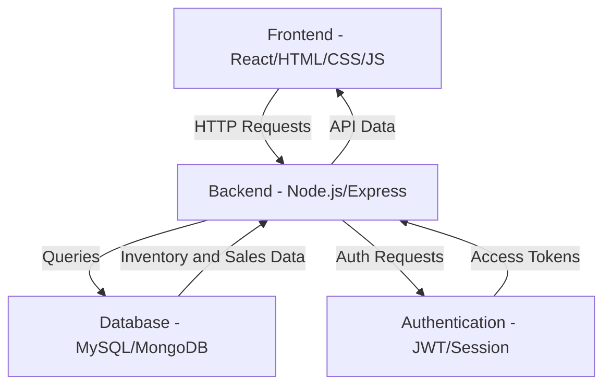
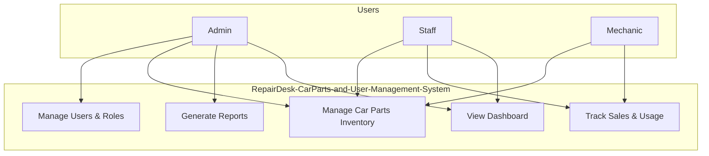

# RepairDesk - CarParts & User Management System

## Overview

RepairDesk-CarParts-and-User-Management-System is a **web-based platform** designed for automobile workshops and spare parts shops.
It enables efficient tracking of car parts, user role management, and maintaining sales/inventory records.

The system provides centralized management to improve workshop operations, reduce paperwork, and ensure better customer service.


## Features

### Inventory / Parts Management

* Add, update, and delete spare parts.
* Track sales and usage of parts in vehicles.
* Real-time stock management.
* Search and filter parts by ID, name, or category.

### User Management

* Role-based access (Admin, Staff, Mechanic).
* Secure login and authentication.
* Track user activities.

### Sales and Records

* Maintain sales records with customer details.
* Track part usage per vehicle.
* Generate sales and usage reports.

### Additional

* Dashboard with analytics and insights.
* Export records (CSV, Excel, PDF).
* Mobile-responsive interface.


## System Architecture




## Use Case Diagram



## Tech Stack Overview

| Technology | Description | Role in Project | 
| ---------------------------------------------------------------------------------------------- | ------------------------------------ | ------------------------------------------------------------------------------------- | 
| <div align="center"><br>React</div> | Frontend library for building UIs | Builds the user interface and handles client-side routing & rendering | | <div align="center"><br>Vite</div> | Frontend build tool | Extremely fast dev server & bundler for React | 
| <div align="center"><br>Tailwind CSS</div> | Utility-first CSS framework | Styles the app responsively and cleanly, with DaisyUI components | | <div align="center"><br>JavaScript</div> | Programming language | Core language used across frontend (React) and backend (Node.js) | 
| <div align="center"><br>Node.js</div> | JavaScript runtime | Runs the Express backend server for APIs and Socket.io | 
| <div align="center"><br>Express</div> | Node.js web framework | Handles HTTP requests, user auth, routing, and initializes Socket.io | 
| <div align="center"><br>Socket.io</div> | Real-time WebSocket library | Enables bi-directional communication for live chat, uses Redis adapter to scale | 
| <div align="center"><br>MongoDB</div> | NoSQL database | Stores users, chat history, and other app data | 
| <div align="center"><br>Kafka</div> | Distributed event streaming platform | Handles message brokering; ensures messages are decoupled & can be processed reliably | 
| <div align="center"><br>Redis</div> | In-memory data store | Enables Socket.io pub/sub for scaling across servers | 
| <div align="center"><br>Docker</div> | Container platform | Runs Kafka, Zookeeper, and Redis services for consistent local dev & deployment | 
| <div align="center"><br>pnpm</div> | Fast JS package manager | Installs project dependencies quickly and efficiently | 
| <div align="center"><br>Postman</div> | API testing tool | Tests REST APIs during development | 
| <div align="center"><br>Git</div> | Version control | Tracks code changes in the project | 
| <div align="center"><br>GitHub</div> | Code hosting platform | Hosts repository for collaboration, CI/CD, and backups |

## DevOps & Observability Stack (Yet to be added...) 
| Technology | Description | Role in Project | 
| -------------------------------------------------------------------------------------------------- | --------------------------- | ---------------------------------------------------------------------------- | 
| <div align="center"><br>Jenkins</div> | Automation server | CI/CD pipeline to build, test, and deploy the application | 
| <div align="center"><br>Docker</div> | Image registry | Stores built container images for consistent deployments | <div align="center"><br>Prometheus</div> | Metrics monitoring system | Collects and stores time-series data, powering Grafana dashboards for system metrics | 
| <div align="center"><br>Grafana</div> | Visualization tool | Dashboards for monitoring metrics & logs | 
| <div align="center"><br>Sentry</div> | Error tracking & monitoring | Captures exceptions, frontend & backend errors, with alerts and stack traces | 
| <div align="center"><br>Trivy</div> | Security scanner | Scans Docker images for vulnerabilities before pushing to prod |

## Installation & Setup

1. Clone the repository

   ```bash
   git clone https://github.com/yourusername/RepairDesk-CarParts-and-User-Management-System.git
   cd RepairDesk-CarParts-and-User-Management-System
   ```

2. Install dependencies

   ```bash
   npm install
   ```

3. Configure environment variables in `.env`

   ```
   DB_HOST=localhost
   DB_USER=root
   DB_PASS=yourpassword
   JWT_SECRET=your_secret_key
   PORT=5000
   ```

5. Start the application

   ```bash
   npm start
   ```

6. Open in browser

   ```
   http://localhost:5000
   ```


## Usage

* **Admin**

  * Manage users and roles
  * Add or remove spare parts
  * Access reports and analytics

* **Staff/Mechanic**

  * Record part usage and sales
  * Search and update inventory
  * Maintain service records


## Future Enhancements

* QR/Barcode scanning for quick part entry.
* Automated billing and invoicing.
* Multi-shop synchronization.
* AI-powered stock forecasting.
* Mobile app integration.

